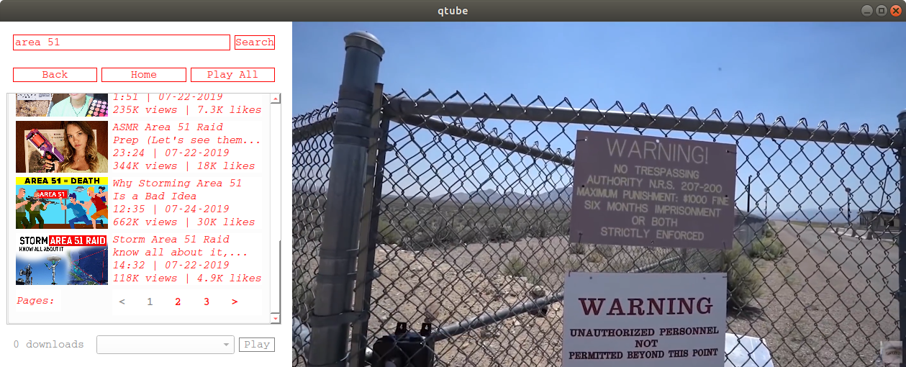

# qtube

**qtube** is a frontend for youtube that uses [pyqt](https://www.riverbankcomputing.com/software/pyqt/download5), [youtube-dl](https://github.com/ytdl-org/youtube-dl) and [mpv](https://mpv.io/) (via [python-mpv](https://github.com/jaseg/python-mpv)). 

<p align="middle">
     
</p>

## Requirements

- Python 3
- youtube-dl
- mpv
- libmpv

## Setup

```
git clone git@github.com:hdbhdb/qtube.git
cd qtube
pip install -r requirements.txt
```

Then to run qtube:

```
python qtube.py
```

## Features & Usage

- watch and browse YouTube without browser and without ads
- play videos natively within application
- download videos
- queue search results as a playlist
- almost anything you can do with mpv (custom scripts are loaded from mpv's scripts directory)

qtube aims to be highly modifiable. Configuration settings are not currently possible within the application, but you use command line options to adjust some simple parameters:

```
qtube [-h] [-u ] [-c [[...]]] [-d ] [-s [[...]]] [-n ]

optional arguments:
  -h, --help            show this help message and exit
  -u [], --home-url []  playlist url to fetch on opening
  -c [ [ ...]], --color [ [ ...]]
                        specify foreground color, background color, inactive
                        color
  -d [], --download-to []
                        directory to download videos to
  -s [ [ ...]], --search [ [ ...]]
                        skip loading home page and search
  -n [], --number []    number of results to load per page

```


Click videos to play natively in player. Right-click for further options (i.e., to download videos). Downloaded videos can be played natively as well. 

Most mpv keybindings will work when the mpv player is selected. Important differences to note are:

- `q` quits the application, not just the player
- `f` brings the player to fullscreen, but `esc` is used to leave fullscreen
- `ctrl+q` and `ctrl+w` quit the application, regardless whether the player or the video search panel is selected


See the [mpv manual](https://mpv.io/manual/stable/#keyboard-control) for details on mpv-specific keybindings.  


    